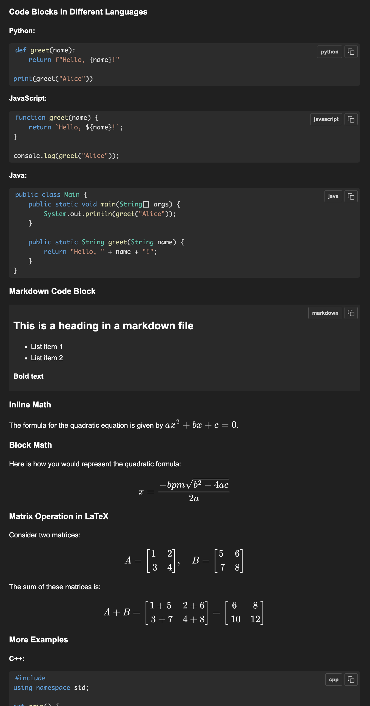

# Mini-Renderer

A lightweight TypeScript package for rendering markdown with code highlighting, LaTeX math, and theme support.

<div align="center">
  
  <p><em>Sample output showing code highlighting, math rendering, and theme support</em></p>
</div>

## Features
- Markdown rendering with code syntax highlighting
- LaTeX math support (inline and display mode)
- Light/Dark theme switching
- Code block copy buttons
- Proper escaping for code blocks and LaTeX content
- Nested markdown rendering in code blocks
- Customizable styling and themes
- TypeScript support with full type definitions

## Installation

```bash
npm install mini-renderer
```

## Usage

### Basic Usage

```typescript
import { MiniRenderer, StyleManager } from 'mini-renderer';

// Initialize renderer and style manager
const renderer = new MiniRenderer();
const styleManager = new StyleManager();

// Inject required styles
styleManager.injectStyles();

// Render content
const content = `
# Example
Here's some code:
\`\`\`typescript
const x = "Hello World";
console.log(x);
\`\`\`

And some math: $E = mc^2$

Matrix:
$$
\\begin{bmatrix}
1 & 2 \\\\
3 & 4
\\end{bmatrix}
$$
`;

const output = renderer.render(content);
document.getElementById('output').innerHTML = output;
```

### Theme Support

```typescript
// Switch to dark theme
styleManager.setTheme('dark');

// Theme toggle example
function toggleTheme() {
    const currentTheme = document.documentElement.getAttribute('data-theme');
    const newTheme = currentTheme === 'light' ? 'dark' : 'light';
    styleManager.setTheme(newTheme);
}
```

### Markdown Features
- Standard markdown syntax (headings, lists, links, etc.)
- Code blocks with language-specific syntax highlighting
- Inline code with backticks
- Tables and blockquotes
- Nested markdown rendering in code blocks

### LaTeX Support
- Inline math with single dollar signs: $E = mc^2$
- Display math with double dollar signs or \[...\]
- Matrix environments with proper row delimiter handling
- Common math symbols and environments
- Configurable MathJax settings

### Code Block Features
- Syntax highlighting for multiple languages
- Automatic language detection
- Copy to clipboard functionality
- Language label display
- Proper quote and character escaping

## Development

1. Clone the repository:
```bash
git clone https://github.com/mxcoppell/mini-renderer.git
cd mini-renderer
```

2. Install dependencies:
```bash
npm install
```

3. Run the demos:
```bash
npm run dev      # Runs the local version demo (port 3030)
npm run npmdemo  # Runs the npm package version demo (port 8080)
```

## Project Structure

```
mini-renderer/
├── packages/
│   ├── core/          # Main package source
│   │   ├── src/
│   │   │   ├── components/
│   │   │   ├── styles/
│   │   │   └── index.ts
│   ├── demo/         # Demo using local source
│   │   ├── src/
│   │   │   ├── client/
│   │   │   ├── server.ts
│   │   │   └── data/
│   └── npmdemo/      # Demo using npm package
│       ├── src/
│       │   └── client/
│       │       ├── app.ts
│       │       └── index.html
│       ├── data/     # Sample markdown files
│       ├── webpack.config.js
│       └── tsconfig.json
```

## Dependencies
- marked: Markdown parsing
- prismjs: Code syntax highlighting
- mathjax: Math equation rendering (peer dependency)

## Browser Support
- Chrome (latest)
- Firefox (latest)
- Safari (latest)
- Edge (latest)

## Changelog

### v0.1.1
- Fixed code block escaping for quotes
- Fixed LaTeX matrix row delimiter handling
- Moved content preprocessing to core package
- Improved demo server configuration
- Added npmdemo package for testing npm distribution
- Updated documentation and examples

### v0.1.0
- Initial release
- Basic markdown rendering
- Code syntax highlighting
- LaTeX math support
- Theme switching

## Contributing
Contributions are welcome! Please feel free to submit a Pull Request.

## License

MIT
